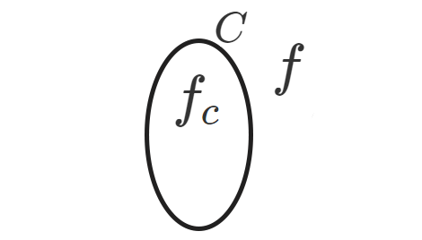
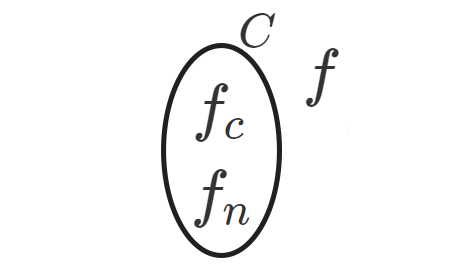

# Estadistica Multivariada Computacional
Estadistica Multivariada Computacional 2019, basado en las clases de Mathias Bourel (IMERL).

<script src='https://cdnjs.cloudflare.com/ajax/libs/mathjax/2.7.5/MathJax.js?config=TeX-MML-AM_CHTML' async></script>

# 1 Historia

<iframe width="100%" height="400" src="https://time.graphics/embed?v=1&id=247437" frameborder="0" allowfullscreen></iframe>
<div><a  style="font-size: 12px; text-decoration: none;" title="Powered by Time.Graphics" href="https://time.graphics">Powered by Time.Graphics</a></div>

# 2 Tipos de aprendizaje automatizado

* Aprendizaje supervisado
* Aprendizaje no supervizado
* *Aprendizaje por refuerzo*

## 2.1 Aprendizaje supervisado

## 2.2 Aprendizaje no supervizado

## 2.3 Aprendizaje por refuerzo

# 3 Bases de datos

Las bases de datos también conocidas como *datasets*, FILL THIS HERE. 
Podemos separarlas en dos tipos, bases de datos con etiqueta (o *label*) y sin etiquetar.

## 3.1 Bases de datos con etiqueta

Las bases de datos con etiqueta son utilizadas para el aprendizaje supervisado.

{:.table}
|$$a_{1}$$|$$a_{2}$$|$$a_{3}$$|$$\cdots$$|$$a_{m}$$|$$y$$|
|-|-|-|-|-|-|
|||$$x_{1}$$|||$$y_{1}$$|
|||$$x_{2}$$|||$$y_{2}$$|
|||$$x_{2}$$|||$$y_{3}$$|
|||$$\vdots$$|||$$\vdots$$|
|||$$x_{n}$$|||$$y_{n}$$|

$$a_{i=1,\ \cdots,\ m} \in A,\  A=\{\ atributos\ \}$$

$$x_{i=1,\ \cdots,\ n}$$  es un vector con los valores de los atributos, $$x_{i}\subset X$$, $$X$$  son las características explicativas.

$$y_{i=1,\ \cdots,\ n}$$ es la variable independiente a predecir $$\in Y$$, puede ser una categoría o un valor continuo $$\in \mathbb{R}$$

Podemos describir a la base de datos como :

$$\{(x_{1},y_{1}),(x_{2},y_{2}),\cdots ,(x_{n},y_{n})\} $$

$$ \forall_{i=1,\ \cdots,\ n}\ (x_{i},y_{i})$$ es una relación de la variable aleatoria multidimensional $$(x,y)$$

El objetivo del aprendizaje automatizado supervisado es encontrar: 

$$f: X\rightarrow Y$$

[Ejemplo Wages Dataset (Kaggle)](https://www.kaggle.com/ljanjughazyan/wages/kernels)

{:.table}
|Height|Sex   |Race |Ed|Age|Earn      |
|------|------|-----|--|---|----------|
|73.89 |male  |white|16|49 |79571.2990|
|66.23 |female|white|16|62 |96396.9886|
|63.77 |female|white|16|33 |48710.6669|
|63.22 |female|other|16|95 |80478.0961|
|63.08 |female|white|17|43 |82089.3455|

En este ejemplo $$x_{1}=(73.89\text{, male, white, }16\text{, }49)$$ mientras que $$y_{1}=79571.2990$$

Podemos observar que la variable $$y\ \in \mathbb{R}$$, por lo que es un problema de regresión.

## 3.2 Bases de datos sin etiqueta

Las bases de datos con etiqueta son utilizadas para el aprendizaje no supervisado.

{:.table}
|$$a_{1}$$|$$a_{2}$$|$$a_{3}$$|$$\cdots$$|$$a_{m}$$|
|-|-|-|-|-|
|||$$x_{1}$$|||
|||$$x_{2}$$|||
|||$$x_{2}$$|||
|||$$\vdots$$|||
|||$$x_{n}$$|||

$$a_{i=1,\ \cdots,\ m} \in A,\  A=\{\ atributos\ \}$$ 

$$x_{i=1,\ \cdots,\ n}$$ es un vector con los valores de los atributos, $$x_{i}\subset X$$

# 4 Aprendizaje automatizado

Como menocionamos anteriormente, el objetivo del aprendizaje supervisado es encontrar: 

$$f: X\rightarrow Y$$

para esto asumimos que existe una relación entre $$Y$$ y $$X=\{x_{1},\ x_{2},\ \cdots,\ x_{m}\}$$ la cual podemos representar de forma general como:

$$Y=f(x)+ \epsilon$$

Donde $$f$$ es una función desconocida y $$\epsilon$$ es el error (independiente de $$X$$ y con $$\mu =0$$, media 0)


<button onclick="showHide()" style="background-color: #555555;border: none;color: white;padding: 8px 20px;text-align: center;text-decoration: none;display: inline-block;font-size: 15px;">Show R code</button>

<div id="TVSalesRCode" style="display: none;">
<p>
    dataset = <font color="orange">read.csv</font> (<font color="green">'./path_to_file.csv'</font>)<br>
    <font color="orange">attach</font> (dataset)<br>
    <font color="orange">plot</font> (TV, sales, type='p', col='darkorchid3', pch=16)<br>
</p>
</div>


```
En este gráfico se muestra la cantidad de ventas (Y) respecto a la cantidad de dinero invertido en publicidad para la TV (X).
```

## 4.1 Función de perdida

La función $$L(y,u)$$ cuantifica cual es la perdida de decir $$u$$ cuando el verdadero valor es $$y$$

Algunos ejemplos de funciones de error para diferentes problemas:

* Clasificación: 
  
  $$L(y,u)=\mathbb{1_{\{u\neq y\}}} \left\{\begin{matrix} 1 & si & u\neq y\\  0 & si & u=y \end{matrix}\right.$$ 

* Regresión:
 
 $$ L(y,u)=(y-u)^2$$

* No supervisado: 

  $$L(u)=-log(u)  \text{(verosimilitud)}$$

Quiero encontrar una función $$f$$ que minimiza el "riesgo de perder".

## 4.2 Función de riesgo teórica:

$$R_{L}(f)=\mathbb{E}[L(y,f(x))]$$

Donde $$\mathbb{E}$$ es la esperanza y $$L(y,f(x))$$ es la perdida, por lo tanto: 

$$f_{C}=ar\underset{f}gmin \ R_{L}(f)= ar\underset{f}gmin \ \mathbb{E}[L(y,f(x))]$$

Buscamos $$f$$ tal que minimiza la función.

Como ejemplo podemos pensar una regresión lineal simple en la que buscamos la recta perteneciente al conjunto $$C$$ de polinomios de grado uno.



Donde $$f$$ es la mejor función (no la conozco y no la voy a conocer) y $$f_{C}$$ es la función que minimiza el error teórico. 
El problema con este planteamiento es que la esperanza depende de la distribución de la variable aleatoria que no la tenemos por lo que $$f_{C}$$ no la voy a conocer.

Como esto no se puede resolver vamos a utilizar los datos. En vez de minimizar el riesgo teórico voy a querer encontrar una función que minimice el riesgo empírico:

$$R_{L,n}(f)=\frac{1}{n}\sum_{n}^{i=1}L(y_{i},f(x_{i}))$$

Esto lo puedo encontrar porque conozco la función de perdida y los datos.

$$ \hat{f_{n}}=ar\underset{f}g\underset{\in}m\underset{C}in\ R_{L,n}(f)=ar\underset{f}g\underset{\in}m\underset{C}in\ \frac{1}{n}\sum_{n}^{i=1}L(y_{i},f(x_{i}))$$



Cuantos más datos se tienen el riesgo empírico $$f_{n}$$ se aproxima más al teórico $$f_{c}$$

$$ar\underset{f}g\underset{\in}m\underset{C}in\ \frac{1}{n} \sum^{n}_{i=1}\ \mathbb{1}(y_{i}, f(x_{i}))$$


<script>function showHide() {var x = document.getElementById("TVSalesRCode");if (x.style.display==="none"){x.style.display="block";}else{x.style.display="none";}}</script>